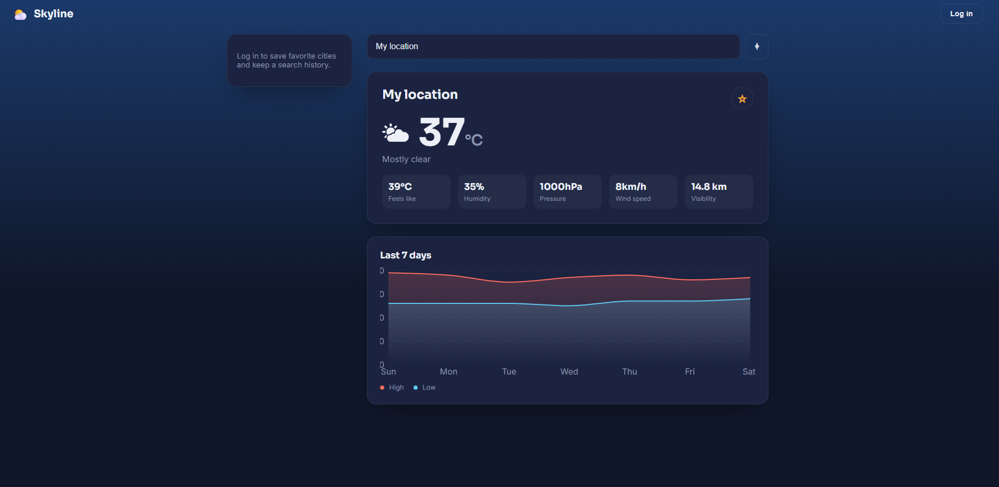
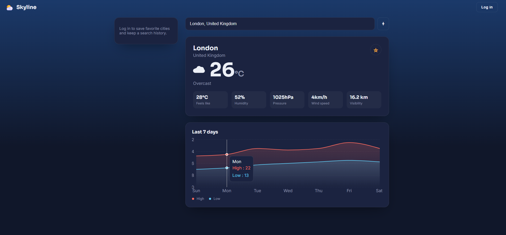
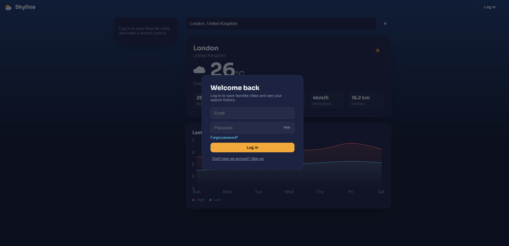

# Skyline — Full-Stack Weather App

A geolocation weather app upgraded into a full MERN-style project: **React (Vite) + Node/Express + MongoDB**.

🔗 **Live demo:** [https://weather-jfhhrmqdj-ykhushi67s-projects.vercel.app/](https://weather-jfhhrmqdj-ykhushi67s-projects.vercel.app/)

## Screenshots





## Features
- Auto-detects your location on load
- Search any city with live autocomplete
- Current conditions: temperature, feels-like, humidity, pressure, wind, visibility
- Real last-7-days temperature history chart
- Severe weather alerts (storms, heavy rain/snow)
- User accounts with login, signup, and password reset
- Save favorite cities and view recent search history

## Project structure
```
weather-app/
  backend/     -> Express API + MongoDB
  frontend/    -> React (Vite) app
```

## Tech details

**Weather data** comes from [Open-Meteo](https://open-meteo.com/) — no API key required. Current conditions and the 7-day chart both come from genuine historical records via Open-Meteo's Archive API, not estimated or cached data.

**MongoDB** stores user accounts, saved favorite cities, and each logged-in user's search history.

## API overview

| Method | Route                     | Auth required | Purpose                          |
|--------|----------------------------|----------------|-----------------------------------|
| POST   | /api/auth/signup           | No             | Create account                   |
| POST   | /api/auth/login            | No             | Log in                           |
| GET    | /api/auth/me               | Yes            | Get current user                 |
| POST   | /api/auth/forgot-password  | No             | Request password reset           |
| POST   | /api/auth/reset-password   | No             | Set new password                 |
| GET    | /api/weather/geocode       | No             | City name -> coordinates         |
| GET    | /api/weather/current       | Optional       | Current weather (logs history if logged in) |
| GET    | /api/weather/history       | No             | Last 7 days of weather           |
| GET    | /api/favorites             | Yes            | List saved cities                |
| POST   | /api/favorites             | Yes            | Save a city                      |
| DELETE | /api/favorites/:id         | Yes            | Remove a saved city               |
| GET    | /api/favorites/history     | Yes            | Recent searches                  |
