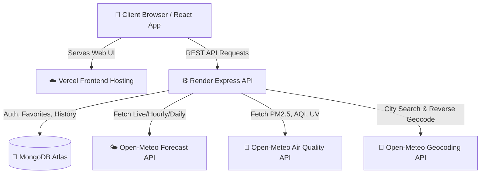

<div align="center">

  <h1>⛅ Skyline Weather</h1>
  <h3>Full-Stack Weather & Environmental Intelligence Platform</h3>

  <p>
    An interactive weather analytics application featuring live forecasts, air quality indices, interactive maps, city comparisons, and user search history.
  </p>

  <p>
    <a href="https://react.dev/"></a>
    <a href="https://vitejs.dev/"></a>
    <a href="https://nodejs.org/"></a>
    <a href="https://expressjs.com/"></a>
    <a href="https://www.mongodb.com/atlas"></a>
  </p>

  <p>
    <a href="https://weather-app-pgfh.vercel.app"><b>🚀 Live Web App Demo</b></a> •
    <a href="https://weather-app-backend-4jl1.onrender.com/api"><b>⚡ Live Backend API</b></a>
  </p>

</div>

---

## 📑 Table of Contents

- [🚀 Live Demo](#-live-demo)
- [✨ Key Features](#-key-features)
- [🏗 System Architecture](#-system-architecture)
- [🛠 Tech Stack](#-tech-stack)
- [🔑 Environment Variables](#-environment-variables)
- [⚡ API Reference](#-api-reference)
- [💻 Quick Start](#-quick-start)

---

## 🚀 Live Demo

- **Frontend App**: [https://weather-app-pgfh.vercel.app](https://weather-app-pgfh.vercel.app)
- **Backend Service**: [https://weather-app-backend-4jl1.onrender.com/api](https://weather-app-backend-4jl1.onrender.com/api)

---

## ✨ Key Features

### 📊 1. Live Weather Dashboard & Geolocation
- **Auto Location Detection**: Instantly retrieves current local weather using browser HTML5 Geolocation.
- **City Search Autocomplete**: Search any global city or region with real-time location suggestions.
- **Comprehensive Metrics**: Displays temperature, apparent ("feels-like") temperature, humidity, pressure, visibility, UV index, cloud cover, and wind speed/direction.

### 🌡 2. Global Unit Conversion System
- Live toggle between **Metric (°C, km/h)** and **Imperial (°F, mph)** units.
- Instant recalculations across all dashboard metrics, forecast tiles, charts, and comparison tables.
- Remembers user preference using `localStorage`.

### 🕐 3. 24-Hour Hourly Forecast
- Interactive horizontal tile strip showing hourly weather icons, temperatures, and rain probability.
- Integrated **Recharts AreaChart** sparkline showing dual-gradient curves for temperature and precipitation likelihood.

### 📅 4. 7-Day Future & Historical Weather
- Multi-day forecast with daily min/max temperature gradient bars, rain chances, and sunrise/sunset times.
- Real **7-day historical weather chart** using Open-Meteo's historical archive data.

### 🌿 5. Air Quality & UV Health Dashboard
- Dual **US AQI** & **European AQI** status meters (Good, Moderate, Poor, Hazardous).
- Individual pollutant breakdowns: $\text{PM}_{2.5}$, $\text{PM}_{10}$, $\text{NO}_2$, $\text{O}_3$, $\text{SO}_2$, and $\text{CO}$.
- **UV Index Meter** with peak hours advisory and protective health guidance.

### 🗺 6. Interactive Weather Map
- Powered by **Leaflet & React-Leaflet** featuring **Esri Dark Canvas**, **Esri Satellite**, and **OpenStreetMap** layers (100% free, no API key required).
- **Click-to-Weather**: Click anywhere on the globe to reverse-geocode coordinates and inspect live weather instantly.

### ⚖️ 7. Side-by-Side City Comparison Mode
- Search and compare two cities simultaneously with difference badges (e.g. `+5°C warmer`, `12% less humid`).

### 🔒 8. User Authentication & Saved Favorites
- JWT-authenticated account registration, login, and password reset.
- Save favorite locations and access recent search history backed by **MongoDB Atlas**.

---

## 🏗 System Architecture


```mermaid
graph TD
    User[📱 Client Browser / React App]
    ViteHost[☁️ Vercel Frontend Hosting]
    RenderBackend[⚙️ Render Express API]
    MongoDB[(🍃 MongoDB Atlas)]
    OpenMeteoForecast[🌤 Open-Meteo Forecast API]
    OpenMeteoAQI[🌿 Open-Meteo Air Quality API]
    OpenMeteoGeo[📍 Open-Meteo Geocoding API]

    User -->|Serves Web UI| ViteHost
    User -->|REST API Requests| RenderBackend
    RenderBackend -->|Auth, Favorites, History| MongoDB
    RenderBackend -->|Fetch Live/Hourly/Daily| OpenMeteoForecast
    RenderBackend -->|Fetch PM2.5, AQI, UV| OpenMeteoAQI
    RenderBackend -->|City Search & Reverse Geocode| OpenMeteoGeo
```

---

## 🛠 Tech Stack

| Domain | Technology | Description |
|---|---|---|
| **Frontend** | React 18, Vite 5 | SPA UI framework & fast builder |
| **Styling** | Vanilla CSS Glassmorphic | Custom CSS tokens, backdrop filters, dynamic gradients |
| **Data Viz & Maps** | Recharts, Leaflet, React-Leaflet | Responsive area charts & interactive maps |
| **Backend** | Node.js, Express.js | REST API server with routing middleware |
| **Database** | MongoDB Atlas, Mongoose | Cloud NoSQL database for users & favorites |
| **Security** | JWT, Bcrypt | Token authentication & password hashing |
| **APIs** | Open-Meteo APIs | Free weather, AQI, archive, & geocoding endpoints |

---

## 🔑 Environment Variables

### Backend (`backend/.env`)
| Variable | Required | Description |
|---|---|---|
| `PORT` | Yes | Express server port (default: `5000`) |
| `MONGO_URI` | Yes | MongoDB Atlas connection string |
| `JWT_SECRET` | Yes | Secret key for signing authentication tokens |
| `CLIENT_URL` | Yes | Allowed frontend origin for CORS (`*` or Vercel URL) |

### Frontend (`frontend/.env`)
| Variable | Required | Description |
|---|---|---|
| `VITE_API_URL` | Yes | Backend REST API base URL (`https://weather-app-backend-4jl1.onrender.com/api`) |

---

## ⚡ API Reference

| Method | Endpoint | Auth | Description |
|---|---|---|---|
| `POST` | `/api/auth/signup` | No | Register new user account |
| `POST` | `/api/auth/login` | No | Authenticate user & receive JWT token |
| `POST` | `/api/auth/forgot-password` | No | Request password reset token |
| `POST` | `/api/auth/reset-password` | No | Reset password using valid token |
| `GET` | `/api/weather/geocode` | No | Search city names to coordinates |
| `GET` | `/api/weather/reverse-geocode` | No | Reverse geocode lat/lon to location name |
| `GET` | `/api/weather/current` | Optional | Get current weather, 24h hourly, and 7-day forecast |
| `GET` | `/api/weather/history` | No | Get past 7 days historical weather data |
| `GET` | `/api/weather/air-quality` | No | Get AQI pollutant concentrations & UV index |
| `GET` | `/api/weather/compare` | No | Compare weather metrics for multiple cities |
| `GET` | `/api/favorites` | Yes | Get logged-in user's saved favorite cities |
| `POST` | `/api/favorites` | Yes | Save a city to user's favorites |
| `DELETE`| `/api/favorites/:id` | Yes | Remove a city from user's favorites |
| `GET` | `/api/favorites/history` | Yes | Get logged-in user's search history |

---

## 💻 Quick Start

### 1. Clone & Install
```bash
git clone https://github.com/Ykhushi67/Weather-app.git
cd Weather-app
```

### 2. Backend Setup
```bash
cd backend
npm install
npm run dev
```

### 3. Frontend Setup
```bash
cd ../frontend
npm install
npm run dev
```
